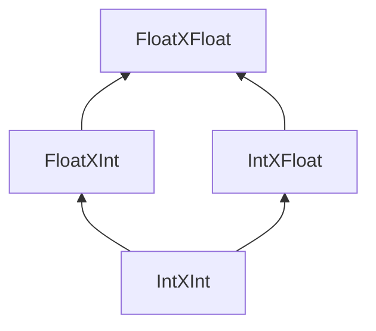
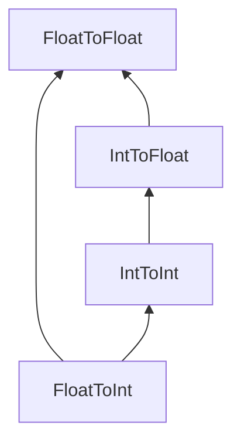

To add subtyping to a language, we define a partial order on types 
$\tau \leq p$ and a rule of subsumption:
$$
\dfrac{}{}
$$

Subtyping allows java programs to declare subclasses.
```java
class Pig extends Animal{}
// Anywhere that an Animal is input, we can supply Pig
```


If you have an expression of type tau and tau is a subtype of p.
then we can treat the expression as type p.
$$
\dfrac{\Gamma \vdash e : \tau \quad \tau \leq q}{\Gamma \vdash upcast\ \rho\ e : \rho}
$$


Partial ordering is reflexive transitive and associative
Reflexive : 
forall a, a is a subtype of itself
Transitive
forall a b c, if a is a subset of b and b is a subset of c, and a is a subset of c.
i.e. BlackSheep <= Sheep <= Animal, 
```
Animal bs = new BlackSheep();
```
Antisymmetric:
"no cycles"
forall a b if a <= b and b <= a, then a == b.

## Partial Ordering definition
There are two main approaches for what subtypes do.

### Upcasting
upcast $v \mapsto v$
This requires type $\tau$ could be judged to have type $p$.
```
For example Int <= Float 
3 + 2.2
```


## Coercion
We set tau to be type p in runtime.
```
we try 3 + 2.2
3 gets typed to float at runtime
```

## Subtyping should be Coherent

We could get different results if we use coercion.

```
3 + "hello" --> "3hello"
(Int <= String)

3 + "hello" --> 3.0 + "hello" --> "3.0hello"

(Int <= Float) --> (Float <= String)
```

This is an issue with bad coercion. So we would normally enforce that subtype coercions are **coherent**, meaning that the result must be the same regardless of which coercion was used first.

## Behavioural Subtyping

Another constraint on subtypes is that syntactic subtypes should correspond to semantic.

### Liskov Substitution Principle

Let f(x) be a property provable about objects x of type p. Then f(y) should be true for objects of type t where t is a subtype of p.

```java
Violation
If
Rectangle <= Square
Then Area(Square) = s^2. But this doesnt work for Rectangles.
```

## Product Types

Assuming Int $\leq$ Float
Suppose I have a coercion function c: Int $\mapsto$ Float
Can I use that to write coercion functions for handling 2 different product types.
We draw the following coercion diagram:


And yes. We can create the coercion functions:
```
c:: Int -> Float
c n = Float n

c1 :: (Int -> Int) -> (Int -> Float)
(IntXFloat) c1 (n, m) = (n, c m)

c2 :: (Int -> Int) -> (Float -> Int)
(IntXFloat) c2 (n, m) = (c n, m)

NOTE how we have 2 functions for 1 output
c3 :: (Float -> Int) -> (Float -> Float)
(FloatXFloat) c3 (n, m) = (n, c m)

c4 :: (Int -> Float) -> (Float -> Float)
(FloatXFloat) c4 (n, m) = (c n, m)
```


So we can conclude for product types
In order for a product type to be a subtype of another subtype,
the rows before must be a subtype of the rows after.

$$
\dfrac{\tau_1 \leq p_1 \quad \tau_2 \leq p_2}{(\tau_1\times\tau_2)\leq(p_1 \times p_2)}
$$

## Sum Types
Same as product types.

## Function Types

Suppose we wanted to change a function from Int -> Int to Int -> Float.
We assume c is Int -> Float.

Say the function is named itoi, (int to int), and we want a coercion function named c1.

itoi = take in an int and returns an int.

so we want the result of itoi.
or in other words for an "int x", \\x -> itoi x

c1 itoi = take in an int, and make it a float
we have c.
c1 itoi = \\x -> c (itoi x)


We cannot use coercion here normally.

After applying the following relationships.




If I want a function from Float to Int

![[Pasted image 20221116093408.png]]

## Invariants, Co-variants and Contravariants

![[Pasted image 20221116093421.png]]


